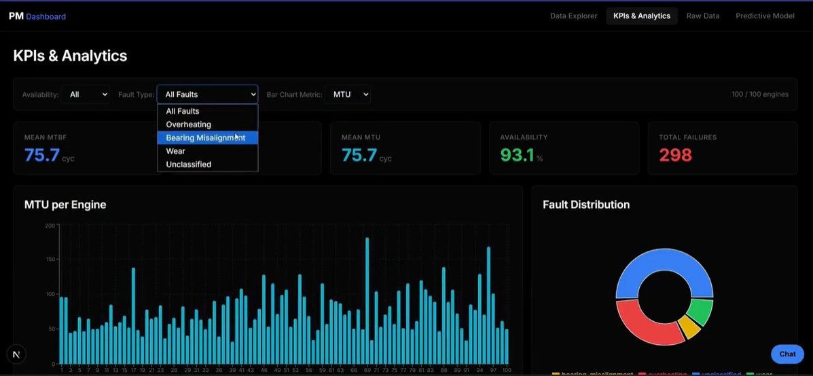

# Maintenance Dashboard


A basic web dashboard for visualizing aircraft engine sensor data and experimenting with an LSTM model for Remaining Useful Life (RUL) prediction.


---

## Overview

This project is a simple interface to look at historical sensor data.

**Features:**
- **KPIs:** Basic stats about fleet health.
- **Telemetry:** Charts displaying sensor readings over time.
- **RUL Prediction:** An LSTM model trained to predict engine lifespan.
- **Chatbot:** A simple LLM integration to answer basic queries.



## Data

The project uses a subset of the **NASA Turbofan Engine Degradation Simulation Dataset (FD001)**:
- Operational settings and sensor measurements per cycle.
- Simulated maintenance and failure events.
- Basic KPI summary.

Data is stored locally in MongoDB.

## Architecture

- **Database:** MongoDB for timeseries and event storage.
- **Backend:** FastAPI to serve data and model predictions.
- **Frontend:** Next.js with Recharts for the UI.
- **Model:** TensorFlow/Keras LSTM network.

## Getting Started

### 1. Prerequisites
- Node.js (v18+)
- Python (3.10+)
- MongoDB (running locally)

### 2. Setup Database
Start your MongoDB service (default `mongodb://localhost:27017/`), then run the ingestion script:
```bash
cd scripts/data_ingestion
python ingest.py
```

### 3. Run the Backend
```bash
cd backend
python -m venv venv
source venv/bin/activate  # On Windows: venv\Scripts\activate
pip install -r requirements.txt
uvicorn main:app --reload
```

### 4. Run the Frontend
```bash
cd frontend
npm install
npm run dev
```

Open `http://localhost:3000` to view the dashboard.
