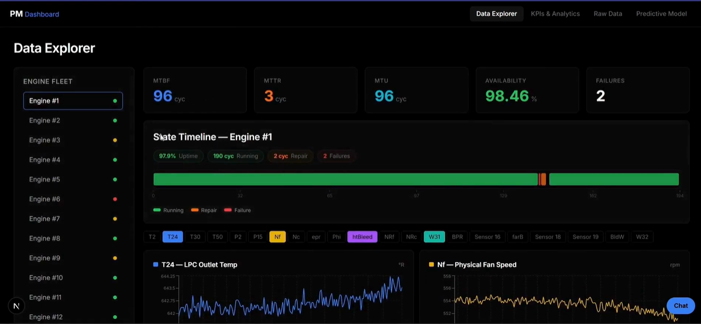
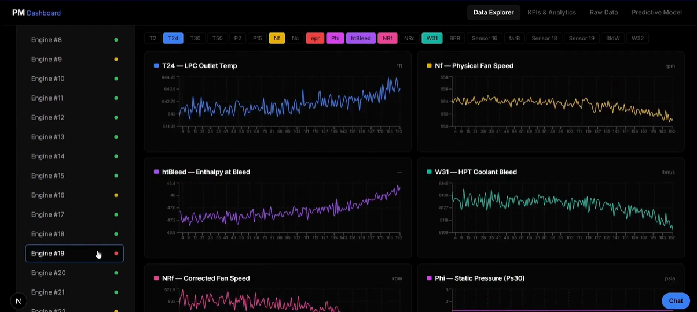

# Predictive Maintenance Dashboard


A full-stack web application for monitoring aircraft turbofan engine health, visualizing telemetry data, and experimenting with Remaining Useful Life (RUL) prediction using an LSTM model.



---

## Overview

This project provides a dashboard to visualize historical sensor data and engine degradation. 

**Key Features:**
- **KPI Tracking:** Basic tracking of fleet health and engine status.
- **Telemetry Visualization:** Charts for exploring engine sensor data.
- **Predictive Analytics:** An experimental Deep Learning (LSTM) model to estimate engine RUL.
- **Maintenance Assistant:** A simple chatbot to query maintenance logs.



## Data

The project uses the **NASA Turbofan Engine Degradation Simulation Dataset (FD001)**.
- **Timeseries Data:** Operational settings and 21 sensor measurements per cycle.
- **Event Logs:** Simulated maintenance and failure events.
- **KPI Summary:** Aggregated health metrics.

Data is stored in **MongoDB**.

## Architecture

1. **Database (MongoDB):** Stores timeseries data, event logs, and KPIs.
2. **Backend (FastAPI):** Serves data and predictions from a pre-trained Keras model.
3. **Frontend (Next.js):** UI built with React, TypeScript, and `recharts`.
4. **Machine Learning:** LSTM neural network for analyzing temporal patterns.

## Technology Stack

**Frontend:** Next.js, TypeScript, Recharts  
**Backend:** FastAPI, Motor (MongoDB driver)  
**Data Science & AI:** TensorFlow / Keras, Pandas, Scikit-Learn

## Getting Started

### 1. Prerequisites
- Node.js (v18+)
- Python (3.10+)
- MongoDB (Local instance or Atlas cluster)

### 2. Setup Database
Start your MongoDB service (default `mongodb://localhost:27017/`), then run the ingestion script:
```bash
cd scripts/data_ingestion
python ingest.py
```

### 3. Run the Backend
```bash
cd backend
python -m venv venv
source venv/bin/activate  # On Windows: venv\Scripts\activate
pip install -r requirements.txt
uvicorn main:app --reload
```

### 4. Run the Frontend
```bash
cd frontend
npm install
npm run dev
```

Navigate to `http://localhost:3000` to view the dashboard.
